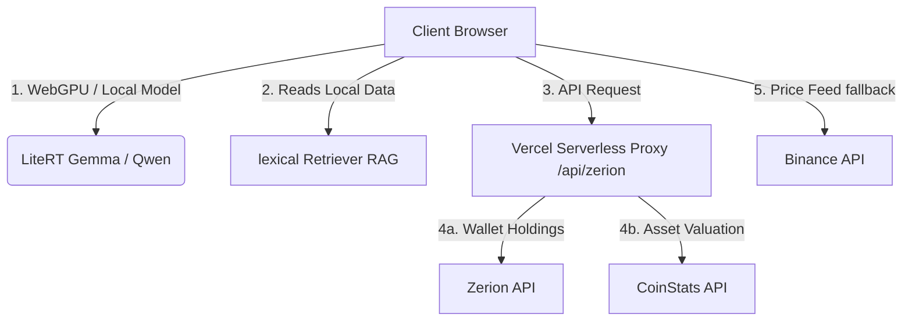

# 🟢 CryptoTracker

A high-performance, privacy-first cryptocurrency portfolio dashboard. It integrates real-time DEX scanning, local WebGPU AI analytics, and historical metric evaluation without server custody.

Live site: [cryptotracker.abhimanyu.fyi](https://cryptotracker.abhimanyu.fyi)

---

## 🛠️ Architecture & Core Flow

The application relies entirely on client-side infrastructure and serverless route helpers.



* **Serverless Backend Proxy**: Requests are routed via `/api/zerion` in [zerion.js](file:///home/abhimanyu/projects/cryptoTracker/api/zerion.js) which forwards requests safely to CoinStats and Zerion. Caching and key signing are processed securely server-side.
* **On-Device LLM & RAG**: Prompt processing, dashboard parsing, and inference happen locally using `@litert-lm/core` via WebGPU.

---

## 🚀 Key Features

* 💼 **Comprehensive Holdings**: Automatically tracks assets, PnL parameters, transaction history, and NFT holdings.
* ⚡ **CoinStats Integration**: First-choice pricing data retrieved via the secure backend proxy with instant fallback support.
* 🛡️ **Dynamic Cache Bypass**: Superuser logins automatically bypass serverless cache pools to query real-time valuation updates.
* 🤖 **Local-First AI Chat**: Gemini, Groq, and on-device LiteRT models analyze your active portfolio state fully privately.
* 🎨 **Aurora Design System**: Interactive animated grids and premium glowing green light rays crafted entirely with CSS.

---

## ⚙️ Development & Deployment

### Run Locally

```bash
npm install
npm run dev
```

### Environment Variables

Configure these settings in Vercel or your local `.env`:

```ini
ZERION_API_KEY=your_zerion_key
COINSTATS_API_KEY=your_coinstats_key
LITELLM_API_KEY=your_litellm_key
SUPERUSER_WALLET=superuser_address
```

### Deploy to Production

```bash
vercel --prod
```

---

## 🔒 Security & Privacy

* **Zero Custody**: Private keys, credentials, and seeds are never requested.
* **Secured Configs**: Sensitive keys are kept server-side to prevent client-side leakage.

---

## 📄 License

MIT © [abhimanyus1997](https://github.com/abhimanyus1997)
